# Art of Mandalas

### [View the live page here](https://art-of-mandalas-3a8ee3ae59a4.herokuapp.com/)

Art of Mandalas is a Django web application created for people who enjoy sharing their most loved Arts and discovering new Mandala arts that other users may have added. The web application offers users the option of creating their own Arts that can be shared on the site, other users may have the option to like and comment on art posts and vise versa. Sign up today and start exploring and sharing, discovering and trying arts to your heart's content.

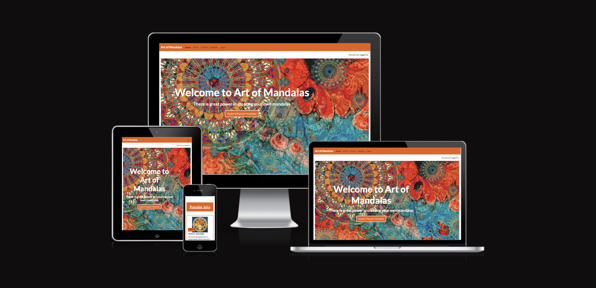

## User Experience (UX)

### Project Goals
The project goal is to create a user-friendly, responsive web application with seamless navigation to each page and from one art post to another as well as user feedback. The webpage allows visitors to explore arts that have been posted by the site admin, read more about the page and cotact page submit a contact form if they wish to be contacted .Logged in users will have access to the share page which will give options as well as the ability to add, update and delete their own arts and like other arts posted on the page.

### Agile Methodology
Epics were created to break down and group user stories which were then further broken down into tasks as steps to follow in the building process of the webpage. These were added to Project Boards on Github to assist with better organisation and prioritisation of the tasks in creating the webpage. 

 User Story Template

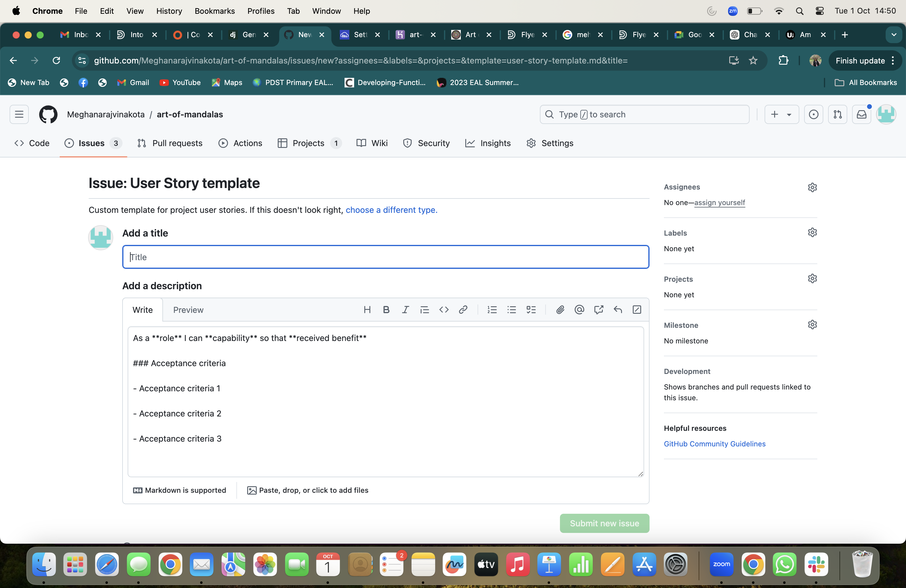

 User Story Issues

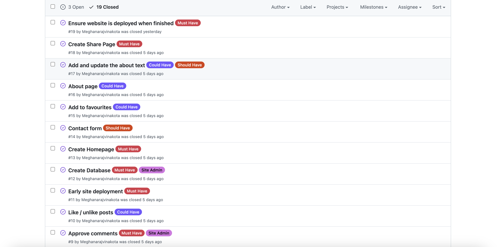

 Project Board

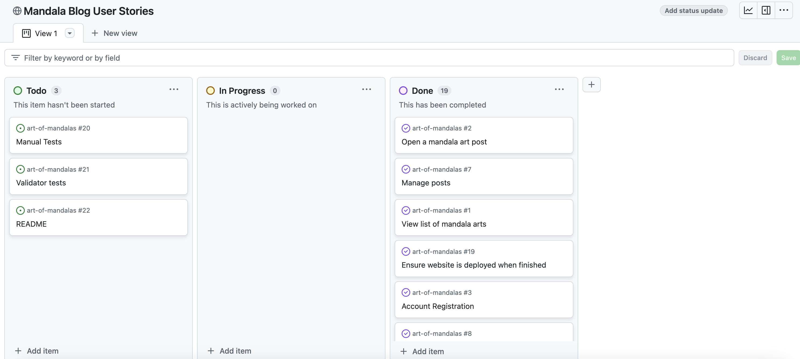

### User Stories

Detailed view of the [project board](https://github.com/users/Meghanarajvinakota/projects/7)

#### Epics:
1. User Experience as a New User / Visitor 
2. User Experience with Comments and Post posts
3. User Profile
4. Administration and Content Management

#### User Stories:
1. User Experience as a New User / Visitor 
    - Visually pleasing and easy to understand home page
    - Easy to navigate web page
    - New User account registration
    - Notifications pop-up to the User
2. User Experience with Comments and Art posts
    - View paginated list of Art posts
    - Like and Comments on Arts posted
3. User Profile
    - My Profile
    - Other users profiles
4. Administration and Content Management
    - Superuser/Admin control over other user accounts

### Target Audience
Art Share is designed for food lovers who:
- Enjoy sharing their art experiences
- Interested in exploring new art ideas
- Seek to network with others who have uploaded arts
- First time artists or people who prefer a guided art experience

### As a first time visitor
- Quickly and easily understand what the webpage is about.
- Navigate the main menu and options available easily.
- Informative content and easy to follow navigation between pages.
- Easily sign up to allow sharing of my own arts and commenting on other Art posts.
- Get notifications for actions performed throughout the page.
- Other users' comments and likes are visible to all users of the site.

### As a returning / logged in user
- Easily navigate through the webpage and art posts from the home page.
- Add a art post with ease, also the benefit of customization of text on some fields when adding an arta.
- Arts show likes on the homepage as well as a short description of what the Post entails.
- Arts are well laid out for easy understanding on the detail view as well as the adding a new art.
- Users can edit and delete arts they have posted.
- Notifications are made visible when changes are successful.
- Users can comment on posts, edit and delete is also available if the comment was created by them.
- Other users' comments are visible to all users of the site.

### As an admin user
- There is a secure login separate from the main webpage for administrators.
- Admin users have full CRUD on the about page, contact requests are made visible here too.
- User accounts can be accessed, edited and deleted here.
- Full CRUD is available on the Post posts and comments to the admin.

## Design (UX)
 Art of Mandalas was designed to have a welcoming, easy to navigate and easy to understand layout. brighter colours were used to allow the art post images to stand out and invite the users in. six art posts were made available on each page with the option to add a new arta to logged in users on the hero image on the share page. Social media links are available to each page for users to be redirected if they wish to see more about the  Art of Mandalas webpage.

### Colour Scheme

### Wireframes

 Home Page as a Guest / Visitor

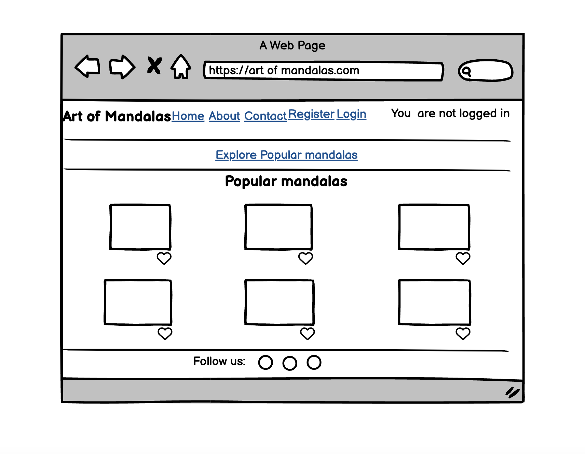
- The search and filter by buttons which are visible below the webpage main heading on the home page for both visitors and users are a future feature to be implemented.
- Share page which would be visible to visitors and logged in users 

 Home Page as a Logged in User

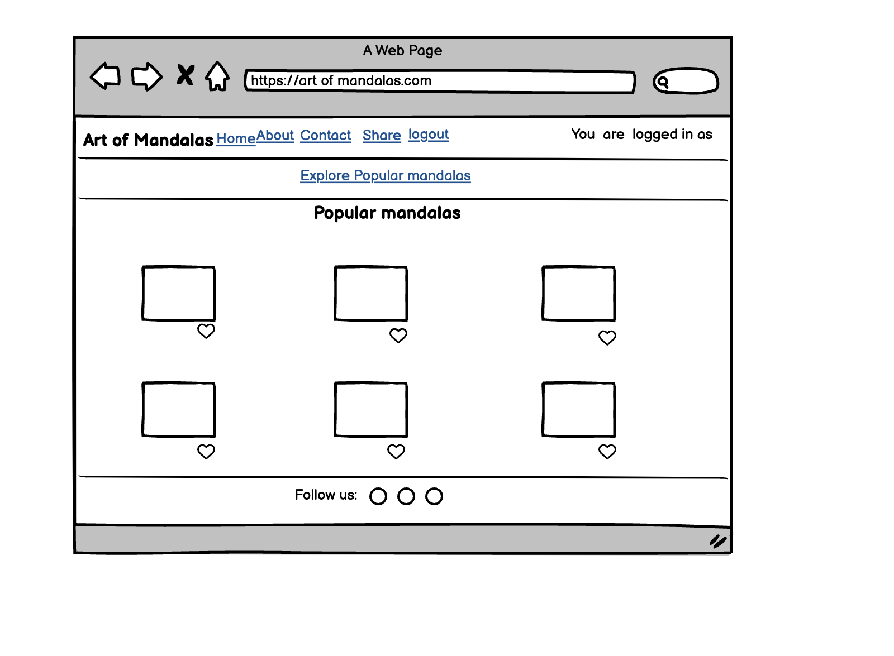

 Sign Up Page

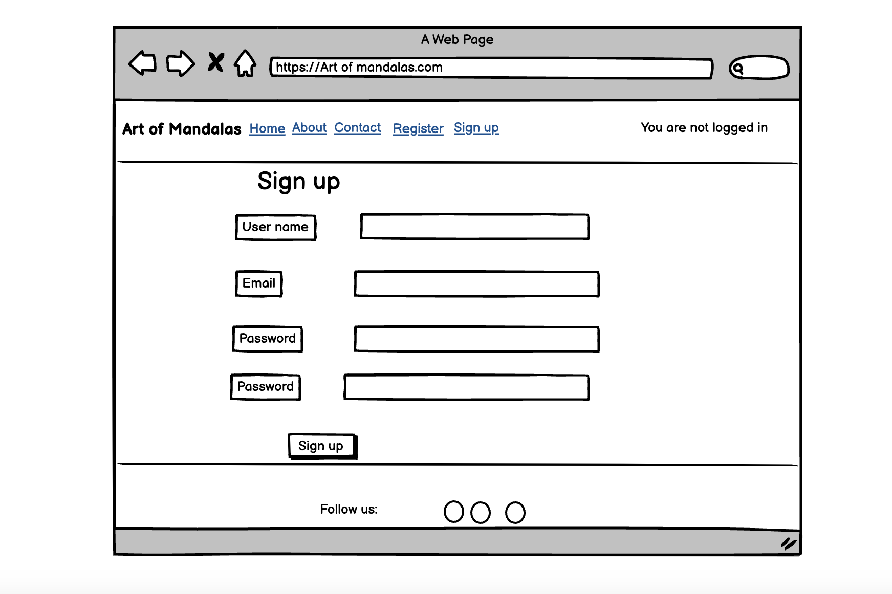

 Login Page

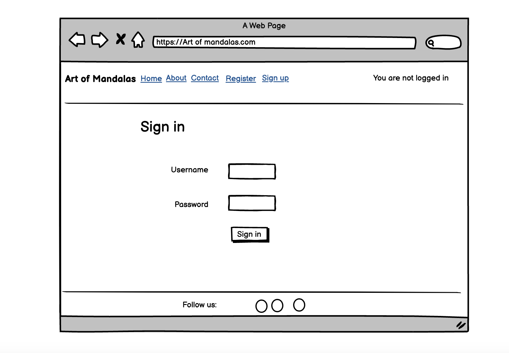

 About Page

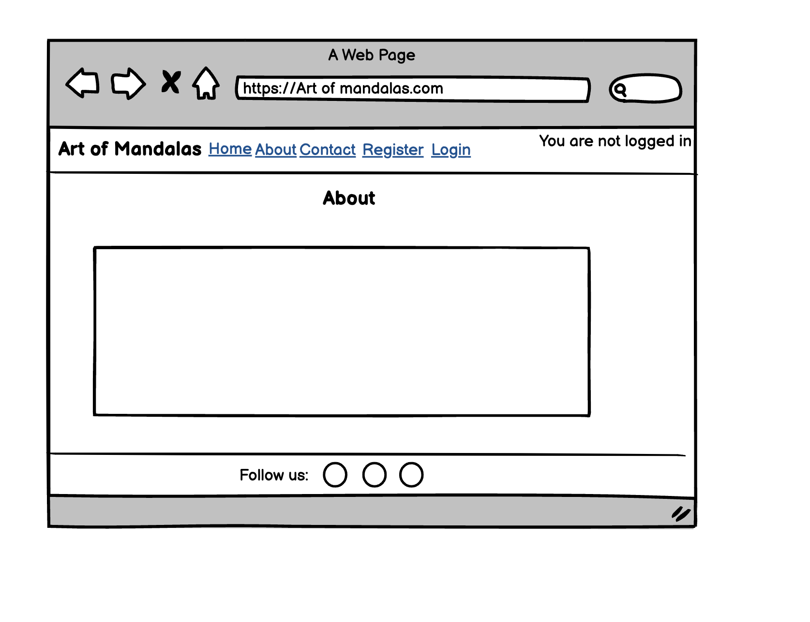

 Contact Page

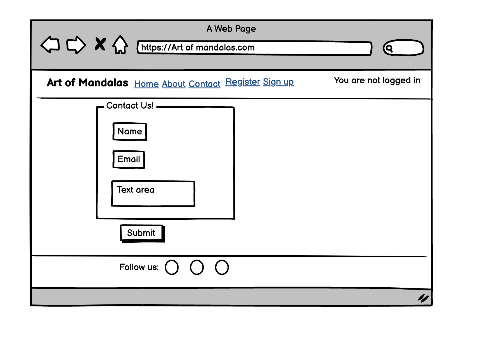

 Share Page

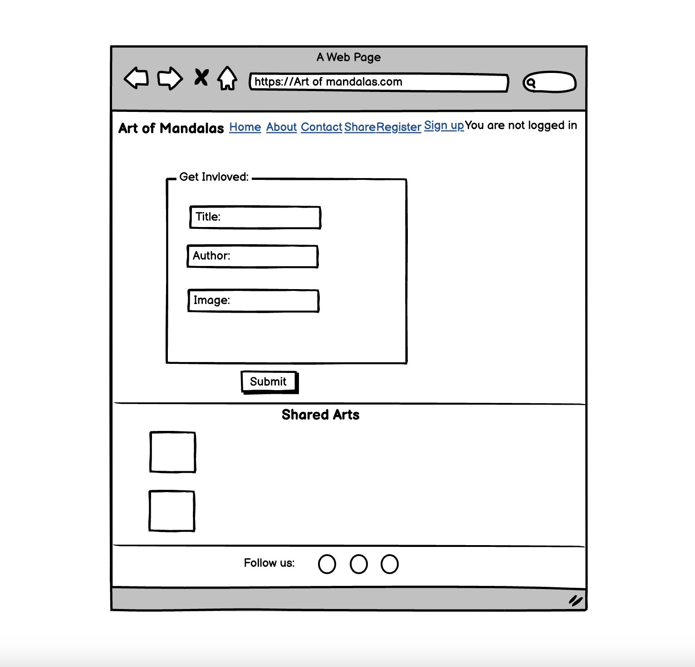

 Post deatil

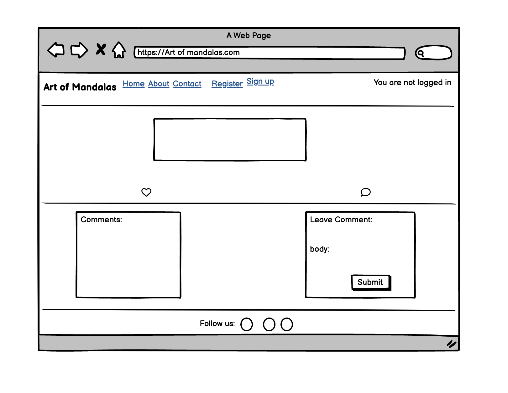

### Database Models

1. AllAuth User Model
    - The Django built AllAuth is used as a default User model and provides user authentication.
    - Pre-defined fields of username, email and password are used.
    - The User is a one-to-many relationship with the post model. 
2. Post Model
    - The Post model was created for visitors to view Posts 
    - The fields can only be done by the site admin with full CRUD functionality.
    - The likes field, a many-to-many relationship was an addition to allow users to like a Post which is made visible to other users below each Post as well as on the home page.
    - Post model has full CRUD functionality to the user
3. Comment Model
    - The Comment Model was created for logged in users to post a comment if they wish on a Post, with a many-to-one relationship as many comments can be posted on one Post.
    - Users see comments posted by other users on Post posts, date, time and who posted the comment is visible to users in the comment section.
    - Comment model has full CRUD functionality to the user
4. Post Likes
    - The Post Likes Model was created for users to show interest in Posts posted on the webpage, with a many-to-one relationship with the User &Post Models as many likes can be made on one Post.
    - Users are able to remove a like if they wish to do so.
5. About Model
    - The About Model was created for users of the web page to get to know more about the site.
6. Contact Model
    - The Contact Model was created for visitors / logged in users to populate their info ie. name, email and message.
    - This information gets sent to the admin section where there is full CRUD available on the form info sent as well as an option to mark it as "read".
7. Share Model
    - The Share Model was created for logged in users to share their oen arts and they can see other arts shared by other users.
    - Share model has full CRUD functionality to the user.
    - User can remove their art when ever they want.

    

 Database Diagram - Entity Relationship Diagram (ERD)

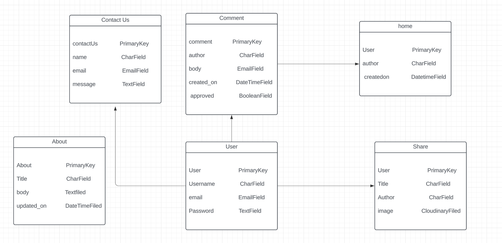

### Custom Error Pages
Error pages have a redirect to the home page button for better user experience
- 404 Page Not Found Error
- 500 Internal Server Error  

### Post details & Images
All art, details and images were taken from [Google](https://www.google.com/) 

### Fonts
Fonts used were 'Lato', 'Raleway' and 'Alice'. All were sourced from Google Fonts.

## Features

- The features on the webpage were designed to be user friendly, easy to navigate and understand while keeping in mind that users may view or make use of the site on different devices. 
- Full CRUD was implemented on both the comments as well as adding an art for logged in users.
- All buttons throughout the webpage are interactive and change colour when hovered over.
- Full CRUD is available in the admin panel for super users and allocated admin on comments, art posts and registered user accounts.

### Existing Features

 Home Page

Visitor

Logged in User

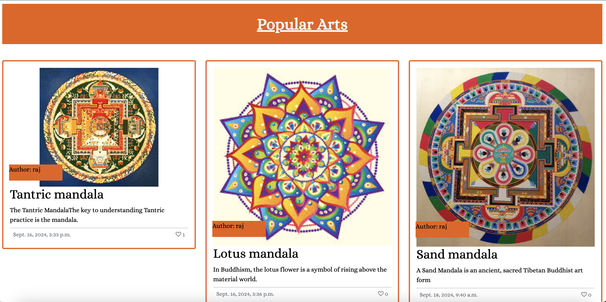

- The home page consists of a total of 6 mandal art posts where the user will have an option to be directed to the next/prev page to view more art posts on the webpage.
- The next/prev button will be available to both logged in users and visitors.
- All  arts will be displayed to the users / visitors from newest to oldest on the main page.
- Arts on the main page show the author name, number of likes as well as the published date stamp.

 Navigation

Visitor

Logged in User

- Webpage name "Art of Mandalas" redirects to the home page when clicked for easy navigation.
- Active pages will show as "darker" text on the nav bar for better user experience.
- The nav bar consists of the home, about,contact and signin/signout/sign-up options as well as the current logged in user's name.

 About Page

Logged in User / Visitor
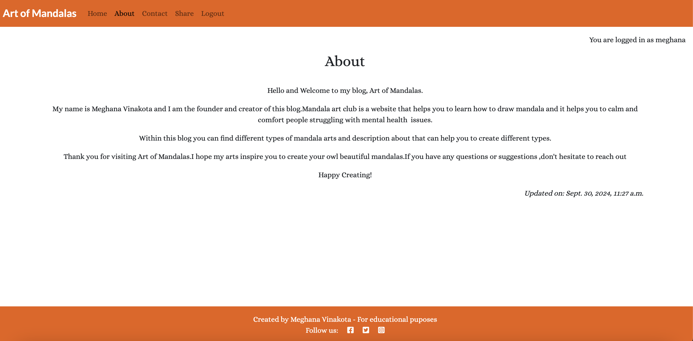

-  As a logged in user / visitor the about page is available to get a better idea of what the webpage is about more information.

 Contact Page

Logged in User / Visitor
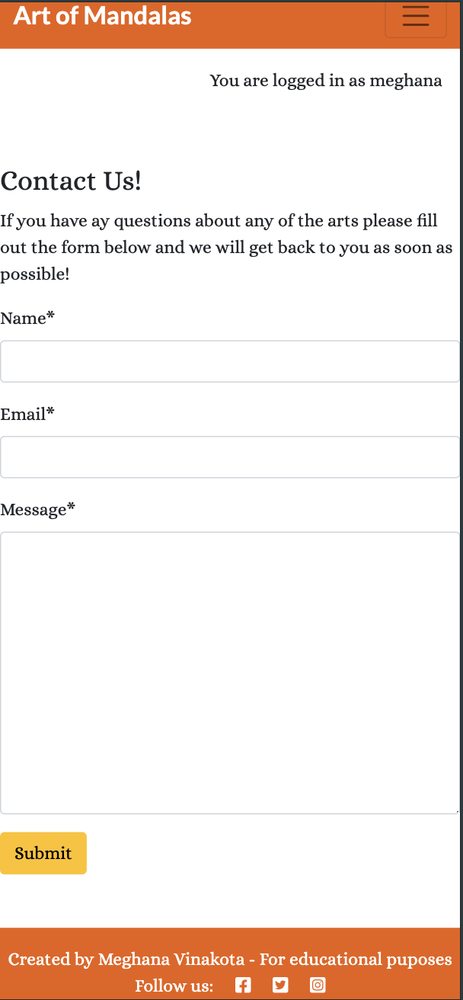

-  As a logged in user / visitor the contact page is available to submit a contact form if they wish to be contacted.

 Share Page

Logged in User 
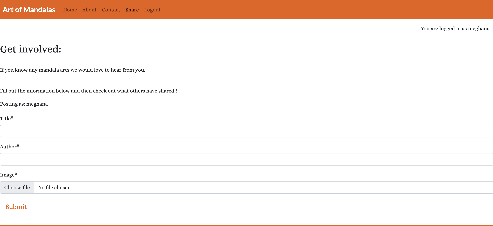
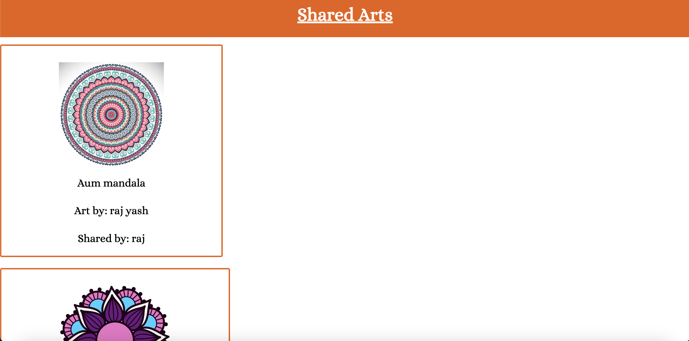
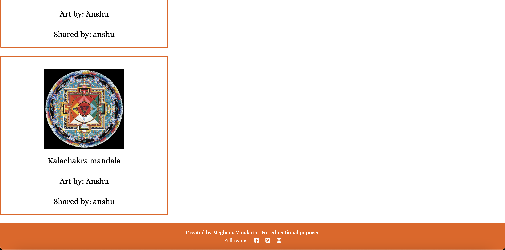

- As a logged in user the share page is available to sharec their own arts and they can see the other arts that other users have been posted.
- As a logge din user they can perform edit and delete opetions
    - If you click edit button it will take to you to the share form then you edit your art.
    - If delete is clicked the user will be prompted to confirm the deletion.
    - If cancelled the user will be redirected back to the Share page.

-  As a logged in user

 Post Detail page

Visitor
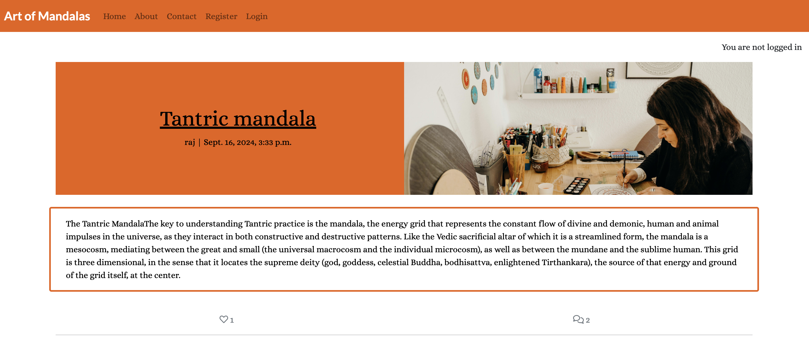
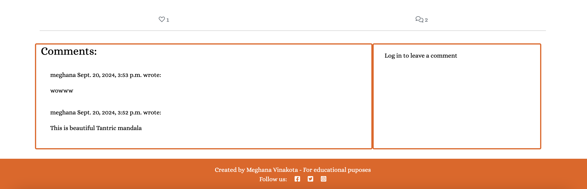

Logged in User

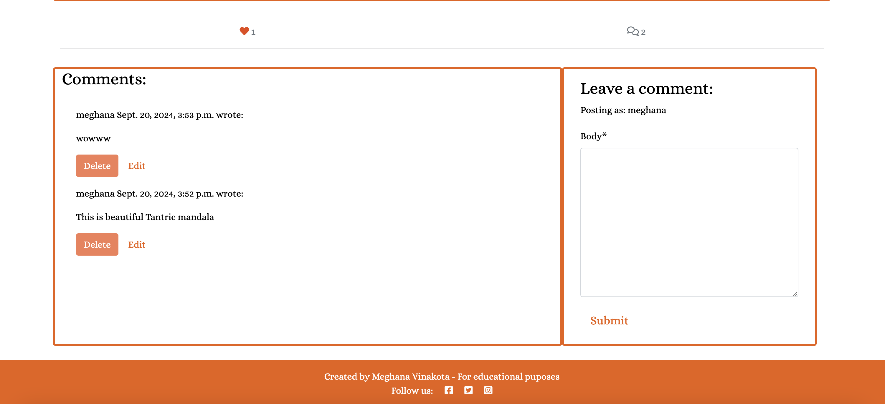

-  The Post detail page is visible to both logged in users and visitors.
- A full detailed post is available to follow, number of likes and comments is shown below the post detail.
- As a logged in user you will be able to like and comment on a post which will be visible to both logged in users and visitors. 
- As a logged in user can access edit and delete button will be visible below the art detail. 
    - If the user clicks on edit they will be redirected to the comment box where they can edit their comment. 
    - If delete is clicked the user will be prompted to confirm the deletion.
        - If cancelled the user will be redirected back to the post detail page.

 Sign Up Page

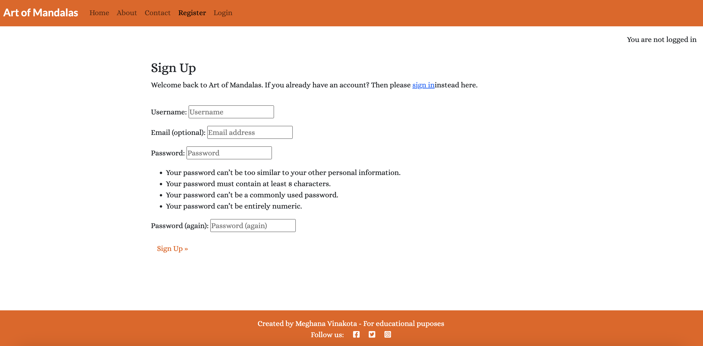

- As a visitor of the page, a sign up is available to register as a site user and enables post adding, likes and commenting on post posts.
- The visitor needs to add a username, email as optional a password and then a confirmation password. 
- After submission of the form the user will be prompted for a successful signing in of the newly created user and directed to the homepage where all features become visible.
- For users who have a login already a link is visible for ease of navigation to the correct page.

 Sign In Page

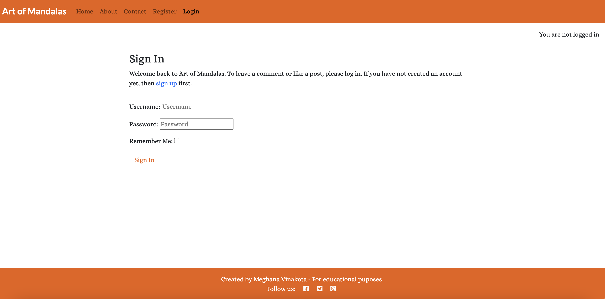

- As a registered site user, a sign in page is available where they can enter using their username and password.
- Once logged in the user will be prompted for a successful signing in and redirected to the home page.
- For users who do not have a login already a link is visible for ease of navigation to the correct page.

 Sign Out Page

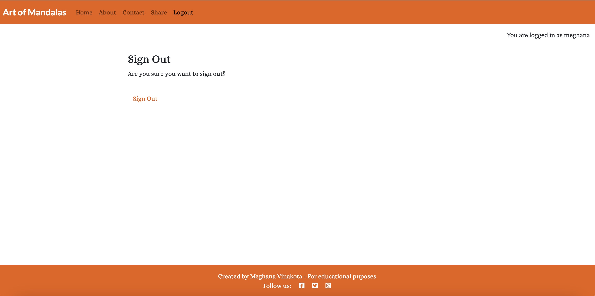

- As a logged in user, a logout page is available where they can successfully logout of the webpage.
- Once logged out the user will be prompted for a successful signing out and redirected to the home page.

 Footer

- The footer gives the webpage information / copyright to the users / visitors of the site and links to social media pages.

 Error Pages

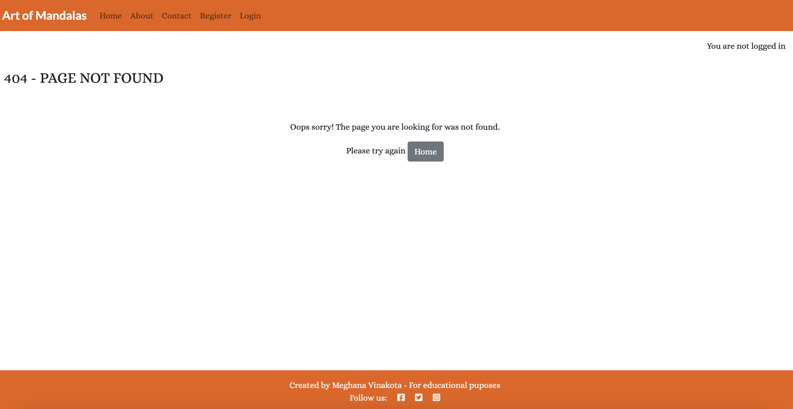

- Custom 404 & 500 error pages were created.
- Buttons to redirect the user / visitor back to the home page were implemented.

 Notifications

- Notifications are prompted at the top of the webpage for all actions the user reacts with.
- A close button is available if the user wishes to dismiss the notifications.

 Delete Modal on Share page 

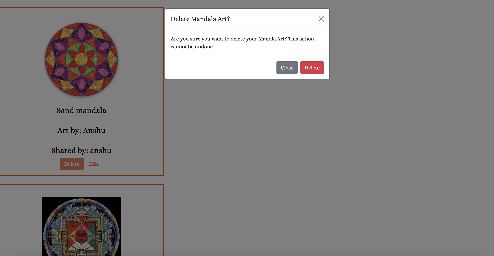

- A delete modal has been implemented to prompt the user when they choose to delete a shared postthey created to prevent accidental deletion.

## Recipe Share | Testing

Comprehensive manual testing has been performed throughout the development of this webpage to ensure the seamless and optimal functionality of all features.

## Manual Testing

### As a visitor

| What was tested | Expected Result | Outcome |
|:---|:---|:---:|
| Click to open links on Nav bar | Redirect to each page | Passed |
| Click on the Logo on the nav bar | Redirect to the home page | Passed|
| Click on the Sign Up, Login, Logout on the nav bar | Redirect to the relevant pages | Passed |
| Click on a Recipe | Redirect to the Recipe detail | Passed |
| Click on the "like" button | No action should take place | Passed |
| Click on the "next" or "back" buttons below the recipe posts | Redirect to the next/prev page | Passed |
| Click on the social media links in the footer | Redirects to the relevant social media page in a new tab | Passed |
| Click on Sign-Up & enter relevant info | Notification of being signed in and the new username created | Passed |

### As a logged in User 

### As a logged in User 

| What was tested | Expected Result | Outcome |
|:---|:---|:---:|
| Click on the "like" button | Add 1 to the number of like and the heart turns red or back to grey if the art was already liked | Passed |
| Populate the comment text area and click the "post comment" button | Creates a comment below the art detail | Passed |
| Click on the delete button on the comments that belongs to the logged in user | The user is redirected to a delete confirmation page, the post is deleted if confirmed | Passed |
| Click on the edit button on the comments that belongs to the logged in user | The comment can be edited | Passed |
| Populate the contact form on the contact page and clicked the submit button | Submits successfully and notifies the user | Passed |
| Populate the share art form on the share page and clicked the submit button | Submits successfully notifies the user | Passed |
| Click on the delete button on the art that belongs to the logged in user | The user is redirected to a delete confirmation page, the art is deleted if confirmed | Passed |
| Click on the edit button on the shared art that belongs to the logged in user | The art can be edited | Passed |
| Click logout in the nav bar | Logout is successful and user is redirected to the Home page | Passed |

### Notifications and Errors

| What was tested | Expected Result | Outcome |
|:---|:---|:---:|
| A user/visitor not being logged in | Notification in the nav bar when "you are not logged in" on the home page | Passed |
| Logout | Notification: "You have signed out." | Passed |
| Login | Notification: "Successfully signed in as {username}." | Passed |
| Sign-up | Notification: "Successfully signed in as {username}." | Passed |
| Post a comment | Notification: "Comment was posted successfully!" | Passed |
| Update a comment | Notification: "Your comment has been successfully updated!" | Passed |
| Delete a comment confirmation | Notification: "Are you sure you want to delete your comment? You cannot undo this action once confirmed." | Passed |
| Delete a comment | Notification: "Your comment has been deleted!" | Passed |
| Contact form submitted | Notification: "Thanks for your message! I will try to read and respond within 5 working days." | Passed |
| Mndala art share post created & submitted | Notification: "Your art has been waiting for approval!" | Passed |
| Manadala art share post edited & submitted | Notification: "Your art has been updated successfully!" | Passed |
| Update art | Notification: "Your art has been successfully updated!" | Passed |
| Delete art confirmation | Notification: "Are you sure you want to delete your art? You cannot undo this action once confirmed." | Passed |
| Delete art | Notification: "Your art has been deleted!" | Passed |
| Appending a page url to the search bar that does not exist  | Redirect to 404 - PAGE NOT FOUND | Passed |

### Layout and built in functionality

| What was tested | Expected Result | Outcome |
|:---|:---|:---:|
| Art posts | Views as newest recipes to oldest on the home page | Passed |
| Time stamps on arts and comments | Views the time a post or comment is created | Passed |
| "Like" icon on home page | "Like" icon and count updates on home page | Passed |
| Comment counter | Displays the correct number of comments | Passed |
| Author banner on the art post | Displays the correct author | Passed |
| Art titles cannot be duplicated | An art wont allow posting if another one exist with the same title | Passed |
| Time stamps on shared arts | Views the time an art is created | Passed |
| Author banner on the shared art post | Displays the correct author | Passed |

### Chrome Developer Tools

Chrome developer tools were used throughout the development of the webpage to test responsiveness. Responsiveness was tested using developer Tools to emulate the following devices:
- Desktop 
- Laptops
- Tablets
- Mobile phones

### Browser Testing

During the development of the webpage the testing was done using Google Chrome. In production the site has been tested on the following browsers:
- Google Chrome
- Microsoft Edge
- Mozilla Firefox
- Opera

## Validation

### [W3C HTML Validator](https://validator.w3.org/)

## Deployment

### Cloning the [GitHub](https://github.com/) repository

Cloning a repository will download a full copy of the data to your computer. This is useful when larger commits need to be pushed, adding or removing files and fixing merge conflicts.

1. Login to GitHub
2. Click the repository you wish to clone (Top left corner)
3. Click 'Code' which is shown above the list of files in the repository
4. Click the 'Local' tab, copy the HTTPS URL
5. Open Gitpod Workspaces, click 'New Workspace'
6. Paste the copied URL into the space given under 'Repository URL'
7. Click 'Continue' and the local clone will be created.

### Forking the [GitHub](https://github.com/) repository

Forking a GitHub repository will allow you to make a copy of the repository, changes can then be made that will not affect the original repository. This is useful for proposed changes, ideas, fixes to an original repository.

1. Login to GitHub
2. Click the repository you wish to fork (Top left corner)
3. Click the 'Fork' drop-down in the top right-hand corner
4. Then click 'Create a new fork' you will now have a copy to work on.

### Database
PostgreSQL from Code Institute was used as the PostgreSQL database for this project.

### [Cloudinary](https://cloudinary.com/)

The API platform has been used to store images uploaded by users of the webpage

1. Login to Cloudinary
2. In the Dashboard, you can copy your API Environment Variable
3. Be sure to remove the CLOUDINARY_URL= as part of the API value; this is the key in Config vars.

### [Heroku](https://heroku.com/apps) deployment

1. Login to Heroku
2. On the Heroku dashboard click on 'New'
3. Select 'Create New App'
4. Add an app name and select your region
5. Click 'Create App'

#### Prepare the workspace environment & settings.py

1. Create an env.py, requirements.txt & Procfile in the main directory of your GitPod workspace
2. Add the DATABASE_URL value and your chosen SECRET_KEY value to the env.py
3. Import the env.py file in your settings.py file and add the SECRETKEY and DATABASE_URL file paths
4. Comment the default database configuration out
5. Save files, make migrations and migrate
6. Add the Cloudinary URL to the env.py file
7. Add the Cloudinary libraries to the list of installed apps in settings.py
8. Add the STATIC files settings - the url, storage path, directory path, root path, media url and default file storage path
9. Link the file to the templates directory in Heroku
10. Change the templates directory to TEMPLATES_DIR
11. Add Heroku to the ALLOWED_HOSTS list in settings.py ['app_name.heroku.com', 'localhost']
12. In settings.py ensure DEBUG = False

#### Ensure the following Config Vars are added in Heroku

1. SECRET_KEY - Any Django secret key
2. CLOUDINARY_URL - Your Cloudinary API key
3. PORT = 8000
4. DISABLE_COLLECTSTATIC = 1 - this is temporary, will be removed for the final deployment
5. DATABASE_URL - Your Postgres database URL

#### Heroku to deploy

1. At the top of the page again, click 'Deploy'
2. Click on 'Github' as your deployment method
3. Search the relevant repo and link these
4. Once linked, select 'Automatic deploys from' or 'Manual Deploy' (Manually deployed branches will need re-deploying each time the GitHub repository is updated)
5. The app will now be hosted on Heroku
6. Click 'Open App' to view the deployed site.

## Technologies Used

### Languages Used

- [Python](https://en.wikipedia.org/wiki/Python_(programming_language))
- [JavaScript](https://en.wikipedia.org/wiki/JavaScript)
- [CSS](https://en.wikipedia.org/wiki/CSS)
- [HTML5](https://en.wikipedia.org/wiki/HTML5)

### Databases Used

- [Cloudinary](https://cloudinary.com/)
    - Used for online static file storage

### Frameworks Used

- [Bootstrap](https://getbootstrap.com/)
    - CSS Framework
- [Django](https://www.djangoproject.com/)
    - Python Framework

### Programs Used

- [Github](https://github.com/)
    - Online code storage
- [Gitpod](https://www.djangoproject.com/)
    - Used as the development environment
- [Git](https://git-scm.com/)
    - Version Control
- [Heroku](https://dashboard.heroku.com/apps)
    - Used to deploy the site (Cloud based)
- [Balsamiq](https://balsamiq.cloud/)
    - Used to create the wireframes
- [Coolers](https://coolors.co/)
    - Used to generate the colours 
- [Am I Responsive](https://ui.dev/amiresponsive?url=https://post-share-58fcaea24fd7.herokuapp.com)
    - Used to for the image across devices in the README.md
- [Chrome DevTools](https://developer.chrome.com/docs/devtools)
    - DevTools was used throughout the process of creating the web page to find bugs and test responsiveness on elements etc
- [JSHint](https://jshint.com/)
  - Used to validate the JavaScript code
- [W3C Markup Validation](https://validator.w3.org/)
  - W3C validator was used to validate all the HTML code
- [W3C CSS Validation](https://jigsaw.w3.org/css-validator/)
  - W3C validator was used to validate all the CSS code 

## Credits
The following documentation, tutorials and guides were used to aid the development process.

- [Font Awesome](https://www.djangoproject.com/)
    - Used for font icons
- [Slack Community](https://app.slack.com/client/T0L30B202/C027C3PLS1W)
    - Slack community for guidance
- [I think therefore I blog](https://learn.codeinstitute.net/courses/course-v1:CodeInstitute+FSD101_WTS+2/courseware/56a2da0940b4411d8a38c2b093a22c60/4565659a34d648b8b8edd063c3182180/)
    - Code Institutes walkthrough project
- 404 & 500 Custom error pages
    - [Thomas Tomo's Project: woodland-whispers-retreat](https://github.com/Thomas-Tomo/woodland-whispers-retreat/tree/main)
    - [Stackoverflow](https://stackoverflow.com/questions/35156134/how-to-properly-setup-custom-handler404-in-django)

## Acknowledgements
Thank you to my mentor Rahul, the Slack community and tutors for all their help throughout this project. 