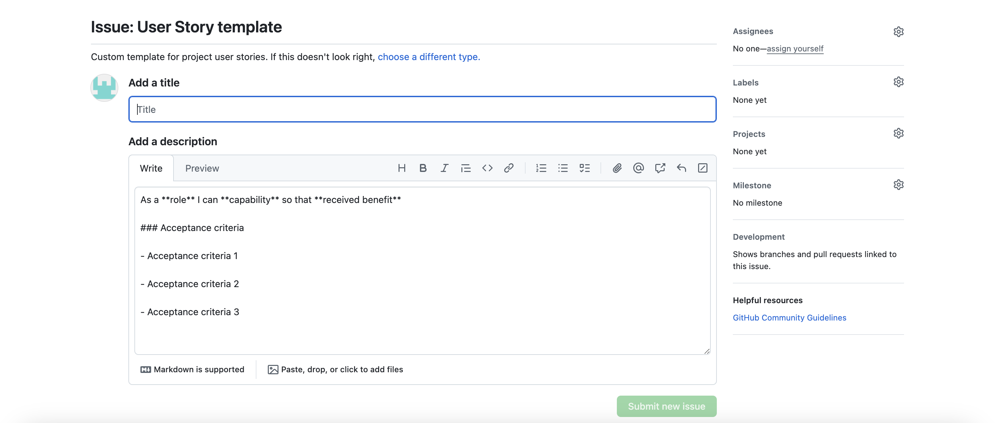

# Art of Mandalas

### [View the live page here](https://art-of-mandalas-3a8ee3ae59a4.herokuapp.com/)

Art of Mandalas is a Django web application created for people who enjoy sharing their most loved Arts and discovering new Mandala arts that other users may have added. The web application offers users the option of creating their own Arts that can be shared on the site, other users may have the option to like and comment on art posts and vise versa. Sign up today and start exploring and sharing, discovering and trying arts to your heart's content.

## User Experience (UX)

### Project Goals
The project goal is to create a user-friendly, responsive web application with seamless navigation to each page and from one art post to another as well as user feedback. The webpage allows visitors to explore arts that have been posted by the site admin, read more about the page and cotact page submit a contact form if they wish to be contacted .Logged in users will have access to the share page which will give options as well as the ability to add, update and delete their own arts and like other arts posted on the page.

### Agile Methodology
Epics were created to break down and group user stories which were then further broken down into tasks as steps to follow in the building process of the webpage. These were added to Project Boards on Github to assist with better organisation and prioritisation of the tasks in creating the webpage. 

 User Story Template

 User Story Issues

 Project Board

### User Stories

Detailed view of the [project board](https://github.com/users/Meghanarajvinakota/projects/7)

#### Epics:
1. User Experience as a New User / Visitor 
2. User Experience with Comments and Recipe posts
3. User Profile
4. Administration and Content Management

#### User Stories:
1. User Experience as a New User / Visitor 
    - Visually pleasing and easy to understand home page
    - Easy to navigate web page
    - New User account registration
    - Notifications pop-up to the User
2. User Experience with Comments and Art posts
    - View paginated list of Art posts
    - Like and Comments on Arts posted
3. User Profile
    - My Profile
    - Other users profiles
4. Administration and Content Management
    - Superuser/Admin control over other user accounts

### Target Audience
Art Share is designed for food lovers who:
- Enjoy sharing their art experiences
- Interested in exploring new art ideas
- Seek to network with others who have uploaded arts
- First time artists or people who prefer a guided art experience

### As a first time visitor
- Quickly and easily understand what the webpage is about.
- Navigate the main menu and options available easily.
- Informative content and easy to follow navigation between pages.
- Easily sign up to allow sharing of my own arts and commenting on other Art posts.
- Get notifications for actions performed throughout the page.
- Other users' comments and likes are visible to all users of the site.

### As a returning / logged in user
- Easily navigate through the webpage and art posts from the home page.
- Add a art post with ease, also the benefit of customization of text on some fields when adding an arta.
- Arts show likes on the homepage as well as a short description of what the recipe entails.
- Arts are well laid out for easy understanding on the detail view as well as the adding a new art.
- Users can edit and delete arts they have posted.
- Notifications are made visible when changes are successful.
- Users can comment on posts, edit and delete is also available if the comment was created by them.
- Other users' comments are visible to all users of the site.

### As an admin user
- There is a secure login separate from the main webpage for administrators.
- Admin users have full CRUD on the about page, contact requests are made visible here too.
- User accounts can be accessed, edited and deleted here.
- Full CRUD is available on the recipe posts and comments to the admin.

## Design (UX)
 Art of Mandalas was designed to have a welcoming, easy to navigate and easy to understand layout. brighter colours were used to allow the art post images to stand out and invite the users in. six art posts were made available on each page with the option to add a new arta to logged in users on the hero image on the share page. Social media links are available to each page for users to be redirected if they wish to see more about the  Art of Mandalas webpage.

### Colour Scheme

